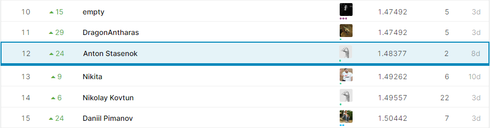
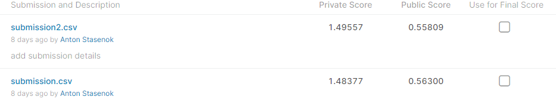

# Домашнее задание № 2 по CV MADE: Optical Character Recognition

В этом репозитории вы найдете код решения Kaggle InClass соревнования "Optical Character Recognition", проходившего рамках курса MADE Computer Vision.

В этом соревновании необходимо было предсказывать номерные знаки автомобилей. На каждом изображении могло быть несколько знаков. Датасет состоит из 25,000 тренировочных изображений..

В данном соревновании я занял 12 место.

Для решения задания использовал мощности Amazon Web Services любезно предоставленные организаторами [made](https://data.mail.ru/). За что им отдельное спасибо. 

# Описание решения

1. Используется MaskRCNN. Предсказываем не только bounding box (детекция), но и маску для номера (сегментация).
2. По маске делаем 4-угольный полигон, который разворачиваем в прямоугольник. Используем для предсказания и bounding box, и маску.
3. Для OCR используется CRNN из лекции.
4. Для того, чтобы понять, действительно ли на картинке номер, используется не только score из детектора, но и норма argmax логитов каждого символа из OCR модели.

Скриншот сабмитов:
